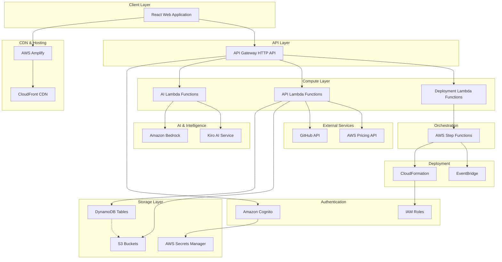
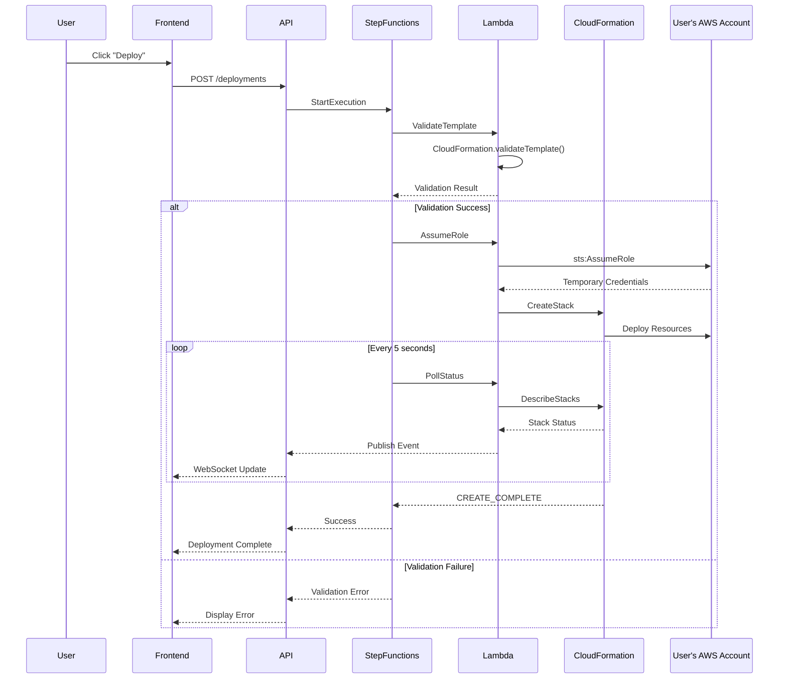

# Design Document: CloudForge AI

## Overview

CloudForge AI is a web-based platform that enables users to design, optimize, and deploy AWS infrastructure through AI-powered natural language processing, visual editing, and automated deployment. The platform bridges the gap between architectural intent and executable infrastructure by combining three core capabilities: AI-driven architecture generation, interactive visual editing, and automated CloudFormation deployment.

### Key Differentiators

- **AI + Visual + Executable**: Unlike competitors that offer only diagramming or only IaC generation, CloudForge AI provides a complete workflow from natural language description to deployed infrastructure
- **Intelligent Optimization**: Built-in AI-powered analyzers for cost reduction, security hardening, and scalability improvements
- **Repository Intelligence**: Automatic architecture detection from existing codebases, enabling rapid migration planning
- **Real-time Feedback**: Live deployment monitoring, cost estimation, and validation feedback throughout the design process

### System Goals

1. **Rapid Architecture Design**: Enable users to go from problem description to deployable infrastructure in under 5 minutes
2. **Correctness**: Ensure generated CloudFormation templates are syntactically valid and follow AWS best practices
3. **Extensibility**: Support easy addition of new AWS services and AI analysis capabilities
4. **Reliability**: Handle deployment failures gracefully with clear error messages and rollback support
5. **Security**: Protect user credentials and infrastructure configurations throughout the workflow


## Architecture

### High-Level Architecture

CloudForge AI follows a serverless, event-driven architecture leveraging AWS managed services for scalability, reliability, and reduced operational overhead.



### Architecture Layers

#### 1. Presentation Layer
- **React + Vite Frontend**: Single-page application with React Flow for visual editing and Monaco Editor for code preview
- **AWS Amplify**: Static site hosting with global CDN distribution via CloudFront
- **Responsive Design**: Adapts to desktop (1280x720+) and tablet (768x1024+) viewports

#### 2. API Layer
- **API Gateway HTTP API**: Low-latency REST API with JWT authorization from Cognito
- **CORS Configuration**: Enables cross-origin requests from Amplify-hosted frontend
- **Rate Limiting**: Protects backend services from abuse (100 requests/minute per user)


#### 3. Business Logic Layer
- **AI Lambda Functions**: Process natural language, generate architectures, perform analysis (cost, security, scalability)
- **API Lambda Functions**: Handle CRUD operations for diagrams, manage GitHub integration, calculate costs
- **Deployment Lambda Functions**: Orchestrate CloudFormation deployments, poll status, handle rollbacks

#### 4. AI & Intelligence Layer
- **Amazon Bedrock**: Provides access to Claude 3.5 Sonnet for architecture generation, optimization, and analysis
- **Kiro AI Service**: Custom AI service for specialized infrastructure reasoning and AWS best practice enforcement

#### 5. Orchestration Layer
- **AWS Step Functions**: Manages long-running deployment workflows with error handling and retry logic
- **State Machine Pattern**: Implements saga pattern for coordinating multi-step deployments with rollback capability

#### 6. Data Layer
- **DynamoDB**: Stores user profiles, diagram metadata, deployment history (single-digit millisecond latency)
- **S3**: Stores diagram JSON exports, CloudFormation templates, and architecture assets
- **AWS Secrets Manager**: Securely stores AWS temporary credentials and GitHub tokens with automatic rotation

#### 7. Deployment Layer
- **AWS CloudFormation**: Executes infrastructure deployments in user accounts via AssumeRole
- **EventBridge**: Publishes deployment events for real-time status updates to frontend via WebSocket


### Deployment Architecture




## Components and Interfaces

### 1. Authentication Service

**Responsibility**: Manage user authentication and AWS account connection

**Technology**: AWS Cognito User Pools + AWS IAM

**Key Operations**:
- User registration and login (email/password)
- JWT token generation and validation (24-hour expiration)
- AWS account connection via IAM AssumeRole
- Credential refresh before expiration

**Interface**:
```typescript
interface AuthenticationService {
  // User authentication
  signUp(email: string, password: string): Promise<AuthResult>
  signIn(email: string, password: string): Promise<AuthResult>
  signOut(userId: string): Promise<void>
  refreshToken(refreshToken: string): Promise<AuthResult>
  
  // AWS connection
  connectAWS(userId: string, roleArn: string, externalId: string): Promise<AWSConnectionResult>
  getAWSCredentials(userId: string): Promise<AWSCredentials>
  refreshAWSCredentials(userId: string): Promise<AWSCredentials>
  disconnectAWS(userId: string): Promise<void>
}

interface AuthResult {
  userId: string
  accessToken: string
  refreshToken: string
  expiresIn: number
}

interface AWSConnectionResult {
  status: 'connected' | 'failed'
  accountId?: string
  error?: string
}

interface AWSCredentials {
  accessKeyId: string
  secretAccessKey: string
  sessionToken: string
  expiration: Date
}
```


### 2. AI Engine Service

**Responsibility**: Generate and optimize AWS architectures using AI

**Technology**: Amazon Bedrock (Claude 3.5 Sonnet) + Kiro AI

**Key Operations**:
- Parse natural language problem descriptions
- Generate AWS architecture diagrams from requirements
- Optimize architectures for cost, security, and scalability
- Analyze GitHub repositories and infer architecture

**Interface**:
```typescript
interface AIEngineService {
  // Architecture generation
  generateArchitecture(description: string, context?: ArchitectureContext): Promise<Architecture>
  
  // Optimization
  optimizeForCost(architecture: Architecture): Promise<OptimizationResult>
  optimizeForSecurity(architecture: Architecture): Promise<OptimizationResult>
  optimizeForScalability(architecture: Architecture, targetScale: ScaleRequirements): Promise<OptimizationResult>
  
  // Repository analysis
  analyzeRepository(repoUrl: string, branch: string): Promise<RepositoryAnalysis>
}

interface ArchitectureContext {
  existingServices?: string[]
  constraints?: Constraint[]
  region?: string
}

interface Architecture {
  services: AWSService[]
  connections: ServiceConnection[]
  metadata: ArchitectureMetadata
}

interface AWSService {
  id: string
  type: string  // e.g., "Lambda", "DynamoDB", "S3"
  name: string
  configuration: Record<string, any>
  position: { x: number, y: number }
}

interface ServiceConnection {
  sourceId: string
  targetId: string
  type: 'sync' | 'async' | 'data'
  protocol?: string
}

interface OptimizationResult {
  optimizedArchitecture: Architecture
  changes: Change[]
  estimatedSavings?: CostEstimate
  rationale: string
}

interface RepositoryAnalysis {
  detectedStack: TechnologyStack
  recommendedArchitecture: Architecture
  migrationRisks: Risk[]
  estimatedCost: CostEstimate
}
```


### 3. Visual Editor Service

**Responsibility**: Provide interactive drag-and-drop diagram editing

**Technology**: React Flow + Custom Node Components

**Key Operations**:
- Render architecture diagrams with AWS service icons
- Handle drag-and-drop operations for services
- Manage service connections and validation
- Edit service configurations in property panels
- Auto-layout for generated diagrams

**Interface**:
```typescript
interface VisualEditorService {
  // Diagram manipulation
  addService(serviceType: string, position: Point): AWSService
  removeService(serviceId: string): void
  moveService(serviceId: string, position: Point): void
  updateServiceConfig(serviceId: string, config: Record<string, any>): void
  
  // Connections
  createConnection(sourceId: string, targetId: string): ServiceConnection
  removeConnection(connectionId: string): void
  validateConnection(sourceId: string, targetId: string): ValidationResult
  
  // Layout
  autoLayout(architecture: Architecture): Architecture
  exportDiagram(architecture: Architecture): string  // JSON
  importDiagram(json: string): Architecture
}

interface Point {
  x: number
  y: number
}

interface ValidationResult {
  valid: boolean
  errors: ValidationError[]
}

interface ValidationError {
  severity: 'error' | 'warning'
  message: string
  field?: string
}
```


### 4. CloudFormation Generator Service

**Responsibility**: Convert visual diagrams to valid CloudFormation templates

**Technology**: Node.js with CloudFormation SDK

**Key Operations**:
- Transform Architecture objects to CloudFormation syntax
- Validate generated templates
- Format templates with proper indentation
- Parse CloudFormation templates back to Architecture objects

**Interface**:
```typescript
interface CloudFormationGenerator {
  // Generation
  generateTemplate(architecture: Architecture): CloudFormationTemplate
  validateTemplate(template: CloudFormationTemplate): ValidationResult
  formatTemplate(template: CloudFormationTemplate): string  // YAML
  
  // Parsing
  parseTemplate(yaml: string): CloudFormationTemplate
  templateToArchitecture(template: CloudFormationTemplate): Architecture
}

interface CloudFormationTemplate {
  AWSTemplateFormatVersion: string
  Description: string
  Parameters?: Record<string, Parameter>
  Resources: Record<string, Resource>
  Outputs?: Record<string, Output>
}

interface Resource {
  Type: string
  Properties: Record<string, any>
  DependsOn?: string | string[]
}

interface Parameter {
  Type: string
  Description?: string
  Default?: any
}

interface Output {
  Description: string
  Value: any
  Export?: { Name: string }
}
```


### 5. Deployment Service

**Responsibility**: Execute CloudFormation deployments in user AWS accounts

**Technology**: AWS Step Functions + Lambda + CloudFormation SDK

**Key Operations**:
- Validate templates before deployment
- Assume role in user's AWS account
- Create/update CloudFormation stacks
- Poll deployment status
- Handle rollback on failure

**Interface**:
```typescript
interface DeploymentService {
  // Deployment operations
  startDeployment(userId: string, template: CloudFormationTemplate, options: DeploymentOptions): Promise<Deployment>
  getDeploymentStatus(deploymentId: string): Promise<DeploymentStatus>
  cancelDeployment(deploymentId: string): Promise<void>
  rollbackDeployment(deploymentId: string): Promise<void>
  
  // History
  getDeploymentHistory(userId: string): Promise<Deployment[]>
  getDeploymentLogs(deploymentId: string): Promise<DeploymentEvent[]>
}

interface DeploymentOptions {
  stackName: string
  region: string
  parameters?: Record<string, string>
  tags?: Record<string, string>
}

interface Deployment {
  id: string
  userId: string
  stackName: string
  status: DeploymentStatus
  startedAt: Date
  completedAt?: Date
  error?: string
}

interface DeploymentStatus {
  phase: 'VALIDATING' | 'IN_PROGRESS' | 'COMPLETE' | 'FAILED' | 'ROLLBACK_IN_PROGRESS' | 'ROLLBACK_COMPLETE'
  completedResources: ResourceStatus[]
  pendingResources: string[]
  failedResources: ResourceStatus[]
}

interface ResourceStatus {
  logicalId: string
  physicalId?: string
  type: string
  status: string
  statusReason?: string
  timestamp: Date
}

interface DeploymentEvent {
  timestamp: Date
  resourceId: string
  status: string
  statusReason?: string
}
```


### 6. Diagram Storage Service

**Responsibility**: Persist and retrieve user diagrams with versioning

**Technology**: DynamoDB (metadata) + S3 (diagram JSON)

**Key Operations**:
- Save diagrams with version control
- List user's diagrams
- Load specific diagram versions
- Export/import diagram JSON

**Interface**:
```typescript
interface DiagramStorageService {
  // CRUD operations
  saveDiagram(userId: string, diagram: DiagramDocument): Promise<string>  // Returns diagramId
  getDiagram(diagramId: string, version?: number): Promise<DiagramDocument>
  listDiagrams(userId: string): Promise<DiagramSummary[]>
  deleteDiagram(diagramId: string): Promise<void>
  
  // Versioning
  listVersions(diagramId: string): Promise<DiagramVersion[]>
  
  // Import/Export
  exportDiagramJSON(diagramId: string): Promise<string>
  importDiagramJSON(userId: string, json: string): Promise<string>
}

interface DiagramDocument {
  id: string
  userId: string
  name: string
  architecture: Architecture
  version: number
  createdAt: Date
  updatedAt: Date
  tags?: string[]
}

interface DiagramSummary {
  id: string
  name: string
  version: number
  updatedAt: Date
  previewUrl?: string
}

interface DiagramVersion {
  version: number
  updatedAt: Date
  updatedBy: string
  changeDescription?: string
}
```


### 7. Cost Estimation Service

**Responsibility**: Calculate estimated monthly costs for architectures

**Technology**: AWS Pricing API + Custom calculation engine

**Key Operations**:
- Calculate costs per service
- Aggregate total monthly cost
- Support multiple regions
- Allow adjustment of usage assumptions

**Interface**:
```typescript
interface CostEstimationService {
  estimateCost(architecture: Architecture, assumptions: UsageAssumptions): Promise<CostEstimate>
  getServiceCost(serviceType: string, config: Record<string, any>, region: string): Promise<number>
  compareCosts(architecture1: Architecture, architecture2: Architecture): Promise<CostComparison>
}

interface UsageAssumptions {
  region: string
  requestsPerMonth?: number
  storageGB?: number
  dataTransferGB?: number
  customAssumptions?: Record<string, any>
}

interface CostEstimate {
  totalMonthlyCost: number
  currency: string
  breakdown: ServiceCost[]
  assumptions: UsageAssumptions
  calculatedAt: Date
}

interface ServiceCost {
  serviceId: string
  serviceName: string
  serviceType: string
  monthlyCost: number
  details: CostComponent[]
}

interface CostComponent {
  name: string
  quantity: number
  unit: string
  unitPrice: number
  subtotal: number
}

interface CostComparison {
  cost1: CostEstimate
  cost2: CostEstimate
  difference: number
  percentChange: number
  significantChanges: ServiceCost[]
}
```


### 8. Repository Analyzer Service

**Responsibility**: Analyze GitHub repositories and generate equivalent AWS architectures

**Technology**: GitHub API + Pattern matching + AI inference

**Key Operations**:
- Clone repository securely
- Detect technology stack from files
- Identify databases, caches, queues
- Generate recommended AWS architecture
- Estimate migration complexity

**Interface**:
```typescript
interface RepositoryAnalyzerService {
  analyzeRepository(repoUrl: string, branch: string, githubToken: string): Promise<RepositoryAnalysis>
  detectStack(files: FileTree): TechnologyStack
  inferArchitecture(stack: TechnologyStack): Architecture
}

interface FileTree {
  files: FileInfo[]
  dependencies: Dependencies
}

interface FileInfo {
  path: string
  content?: string
  language?: string
}

interface Dependencies {
  packageManagers: string[]
  packages: Record<string, string>
}

interface TechnologyStack {
  language: string
  framework?: string
  database?: string[]
  messageQueue?: string
  cache?: string
  storage?: string
  runtime?: string
}

interface Risk {
  category: 'compatibility' | 'performance' | 'security' | 'cost'
  severity: 'low' | 'medium' | 'high'
  description: string
  mitigation?: string
}
```


## Data Models

### DynamoDB Tables

#### Users Table

**Table Name**: `cloudforge-users`

**Primary Key**: `userId` (String, Partition Key)

**Attributes**:
```typescript
interface UserRecord {
  userId: string              // Partition key (Cognito sub)
  email: string
  createdAt: string           // ISO 8601 timestamp
  lastLoginAt?: string
  awsAccountId?: string
  awsRoleArn?: string
  awsExternalId?: string
  credentialsSecretArn?: string
  githubConnected: boolean
  githubTokenSecretArn?: string
  preferences: {
    defaultRegion?: string
    theme?: 'light' | 'dark'
  }
}
```

**Indexes**:
- None required (queries by userId only)

**TTL**: None


#### Diagrams Table

**Table Name**: `cloudforge-diagrams`

**Primary Key**: 
- `diagramId` (String, Partition Key)
- `version` (Number, Sort Key)

**Attributes**:
```typescript
interface DiagramRecord {
  diagramId: string           // Partition key (UUID)
  version: number             // Sort key
  userId: string              // GSI partition key
  name: string
  s3Key: string               // S3 path to diagram JSON
  previewUrl?: string
  tags?: string[]
  createdAt: string
  updatedAt: string
  updatedBy: string
  changeDescription?: string
}
```

**Global Secondary Indexes**:
- **UserDiagramsIndex**: 
  - Partition Key: `userId`
  - Sort Key: `updatedAt`
  - Projection: ALL

**TTL**: None


#### Deployments Table

**Table Name**: `cloudforge-deployments`

**Primary Key**:
- `deploymentId` (String, Partition Key)

**Attributes**:
```typescript
interface DeploymentRecord {
  deploymentId: string        // Partition key (UUID)
  userId: string              // GSI partition key
  diagramId?: string
  stackName: string
  region: string
  status: 'VALIDATING' | 'IN_PROGRESS' | 'COMPLETE' | 'FAILED' | 'ROLLBACK_IN_PROGRESS' | 'ROLLBACK_COMPLETE'
  templateS3Key: string       // S3 path to CloudFormation template
  parameters?: Record<string, string>
  tags?: Record<string, string>
  createdResources: string[]  // List of physical resource IDs
  failedResources?: Array<{
    logicalId: string
    reason: string
  }>
  startedAt: string
  completedAt?: string
  error?: string
  stepFunctionArn?: string
  stackId?: string
  ttl?: number                // For automatic cleanup of old deployments
}
```

**Global Secondary Indexes**:
- **UserDeploymentsIndex**:
  - Partition Key: `userId`
  - Sort Key: `startedAt`
  - Projection: ALL

**TTL**: `ttl` attribute (90 days after completion)


### S3 Buckets

#### Diagrams Bucket

**Bucket Name**: `cloudforge-diagrams-{account-id}`

**Purpose**: Store diagram JSON files

**Structure**:
```
/{userId}/{diagramId}/v{version}.json
```

**Lifecycle Policy**:
- Transition to Intelligent-Tiering after 30 days
- No expiration (manual deletion only)

**Encryption**: SSE-S3 (AES-256)

**Versioning**: Enabled

**Access Control**: Private (Lambda access only via IAM roles)


#### Templates Bucket

**Bucket Name**: `cloudforge-templates-{account-id}`

**Purpose**: Store CloudFormation templates for deployments

**Structure**:
```
/{userId}/{deploymentId}/template.yaml
```

**Lifecycle Policy**:
- Transition to Glacier after 90 days
- Delete after 1 year

**Encryption**: SSE-S3 (AES-256)

**Versioning**: Disabled (templates are immutable per deployment)

**Access Control**: Private (Lambda and CloudFormation access via IAM roles)


### Secrets Manager

#### AWS Credentials Secret

**Secret Name**: `cloudforge/aws-credentials/{userId}`

**Purpose**: Store temporary AWS credentials for user accounts

**Format**:
```json
{
  "accessKeyId": "ASIA...",
  "secretAccessKey": "...",
  "sessionToken": "...",
  "expiration": "2025-01-15T10:30:00Z",
  "roleArn": "arn:aws:iam::123456789012:role/CloudForgeRole",
  "externalId": "unique-external-id"
}
```

**Rotation**: Every 1 hour (before credential expiration)

**Encryption**: AWS KMS (default key)


#### GitHub Token Secret

**Secret Name**: `cloudforge/github-token/{userId}`

**Purpose**: Store GitHub OAuth access tokens

**Format**:
```json
{
  "accessToken": "gho_...",
  "refreshToken": "ghr_...",
  "expiresAt": "2025-01-15T10:30:00Z",
  "scopes": ["repo"]
}
```

**Rotation**: Automatic when token expires (GitHub OAuth refresh)

**Encryption**: AWS KMS (default key)


## Correctness Properties

*A property is a characteristic or behavior that should hold true across all valid executions of a system—essentially, a formal statement about what the system should do. Properties serve as the bridge between human-readable specifications and machine-verifiable correctness guarantees.*

The CloudForge AI system includes two critical serialization/deserialization components that are well-suited for property-based testing: the CloudFormation template parser and the diagram JSON parser. These components must maintain data integrity through round-trip transformations, making them ideal candidates for universal property verification.

### Property 1: CloudFormation Parsing Success

*For any* valid CloudFormation template (YAML or JSON format), the parser SHALL successfully parse it into an internal representation without errors.

**Validates: Requirements 6.1**

### Property 2: CloudFormation Parse Error Reporting

*For any* malformed CloudFormation template, the parser SHALL return descriptive error messages that include the specific syntax error and line number where the error occurred.

**Validates: Requirements 6.2**

### Property 3: CloudFormation Pretty Printing Validity

*For any* valid internal CloudFormation representation, the pretty printer SHALL produce syntactically valid CloudFormation YAML that conforms to the CloudFormation specification.

**Validates: Requirements 6.3**


### Property 4: CloudFormation Round-Trip Equivalence

*For any* valid CloudFormation internal representation, serializing it to YAML then parsing it back SHALL produce an object equivalent to the original representation (parse(print(x)) ≡ x).

**Validates: Requirements 6.4**

### Property 5: CloudFormation Formatting Idempotence

*For any* CloudFormation internal representation, applying the pretty printer multiple times SHALL always produce identical output (print(x) = print(print(parse(print(x))))).

**Validates: Requirements 6.5**

### Property 6: Diagram Parsing Success

*For any* valid diagram JSON, the parser SHALL successfully parse it into an internal Architecture_Diagram representation without errors.

**Validates: Requirements 14.1**

### Property 7: Diagram Parse Error Reporting

*For any* invalid diagram JSON (missing required fields, incorrect types, malformed structure), the parser SHALL return descriptive validation errors that identify the specific issue.

**Validates: Requirements 14.2**

### Property 8: Diagram Pretty Printing Validity

*For any* valid Architecture_Diagram object, the pretty printer SHALL produce syntactically valid JSON that conforms to the diagram schema.

**Validates: Requirements 14.3**


### Property 9: Diagram Round-Trip Equivalence

*For any* valid Architecture_Diagram object, serializing it to JSON then parsing it back SHALL produce an object equivalent to the original (parse(print(x)) ≡ x).

**Validates: Requirements 14.4**

### Property 10: Diagram Formatting Consistency

*For any* Architecture_Diagram object, applying the pretty printer multiple times SHALL always produce identical JSON output with consistent formatting and indentation.

**Validates: Requirements 14.5**


## Error Handling

### Error Handling Philosophy

CloudForge AI adopts a **graceful degradation** approach where errors are caught early, reported clearly, and allow users to recover without losing work. The system distinguishes between recoverable errors (user input issues, temporary service failures) and non-recoverable errors (system bugs, critical service outages).

### Error Categories

#### 1. User Input Errors

**Examples**: Invalid CloudFormation syntax, incompatible service connections, missing required configurations

**Handling Strategy**:
- Validate input client-side before API calls
- Return structured error responses with field-level details
- Provide actionable remediation steps
- Highlight errors in the UI at the point of failure

**Response Format**:
```typescript
{
  "error": {
    "type": "ValidationError",
    "message": "Architecture validation failed",
    "details": [
      {
        "field": "services[2].configuration.memorySize",
        "message": "Memory size must be between 128 and 10240 MB",
        "value": 50
      }
    ]
  }
}
```


#### 2. External Service Errors

**Examples**: AWS API throttling, Bedrock timeouts, GitHub rate limits, CloudFormation deployment failures

**Handling Strategy**:
- Implement exponential backoff with jitter (3 retries: 1s, 2s, 4s)
- For idempotent operations (GET, PUT with same data), retry automatically
- For non-idempotent operations (POST, DELETE), return error and let user retry
- Cache responses where appropriate to reduce external calls
- Provide fallback behavior when possible (e.g., cached cost estimates)

**Response Format**:
```typescript
{
  "error": {
    "type": "ServiceError",
    "service": "AWS CloudFormation",
    "message": "Deployment failed: Resource creation timeout",
    "retryable": true,
    "retryAfter": 60,
    "details": {
      "stackId": "arn:aws:cloudformation:...",
      "failedResource": "MyLambdaFunction",
      "statusReason": "The function could not be created due to a timeout"
    }
  }
}
```

#### 3. Authentication & Authorization Errors

**Examples**: Expired JWT, insufficient AWS permissions, invalid AssumeRole configuration

**Handling Strategy**:
- Refresh tokens automatically when expired (before API calls)
- Redirect to login when refresh fails
- For AWS permission errors, provide the specific IAM action required
- Guide users through AssumeRole setup with detailed instructions

**Response Format**:
```typescript
{
  "error": {
    "type": "AuthorizationError",
    "message": "Insufficient AWS permissions",
    "requiredPermissions": [
      "cloudformation:CreateStack",
      "cloudformation:DescribeStacks",
      "iam:PassRole"
    ],
    "documentation": "https://docs.cloudforge.ai/aws-permissions"
  }
}
```


#### 4. System Errors

**Examples**: Lambda timeouts, DynamoDB capacity exceeded, S3 write failures, unhandled exceptions

**Handling Strategy**:
- Log all errors to CloudWatch with full context (request ID, user ID, stack trace)
- Return generic error message to user (don't expose internal details)
- Provide "Report Issue" button that captures error ID for support
- Alert on-call engineer for critical errors (via CloudWatch Alarms)
- Implement circuit breakers for cascading failures

**Response Format**:
```typescript
{
  "error": {
    "type": "SystemError",
    "message": "An unexpected error occurred. Our team has been notified.",
    "errorId": "err_a1b2c3d4e5",
    "supportContact": "support@cloudforge.ai"
  }
}
```

### Auto-Save and Recovery

- **Auto-save**: Diagram changes auto-save to local storage every 30 seconds
- **Recovery**: On page reload, check for unsaved changes and prompt user to restore
- **Conflict Resolution**: If server state differs from local state, show diff and let user choose
- **Operation Queue**: Queue failed operations (diagram saves, deployments) for retry when connectivity restores

### Error Monitoring

- **CloudWatch Logs**: All Lambda invocations log structured JSON with request/response
- **CloudWatch Metrics**: Track error rates per API endpoint and service
- **Alarms**: Alert when error rate exceeds 5% for any endpoint over 5-minute period
- **X-Ray**: Trace requests across services to identify latency and failure points


## Testing Strategy

### Overview

CloudForge AI employs a multi-layered testing strategy that combines property-based testing for core data transformations, example-based unit tests for business logic, integration tests for external services, and end-to-end tests for critical user workflows.

### Testing Pyramid

```
           E2E Tests (5%)
         ┌─────────────┐
         │  Critical   │
         │   Flows     │
         └─────────────┘
       
      Integration Tests (25%)
    ┌─────────────────────┐
    │  Service Contracts  │
    │   AWS, GitHub, DB   │
    └─────────────────────┘
    
    Unit + Property Tests (70%)
  ┌─────────────────────────┐
  │   Business Logic        │
  │   Parsers (PBT)         │
  │   Transformations       │
  └─────────────────────────┘
```


### Property-Based Testing (PBT)

**When Applied**: Parser and serialization components (CloudFormation and Diagram parsers)

**Library**: [fast-check](https://github.com/dubzzz/fast-check) for TypeScript/JavaScript

**Configuration**: Minimum 100 iterations per property test

**Tag Format**: Each test includes a comment referencing the design property:
```typescript
// Feature: cloudforge-ai, Property 4: CloudFormation Round-Trip Equivalence
it('should maintain equivalence through parse-print-parse round trip', () => {
  fc.assert(
    fc.property(cfnTemplateArbitrary(), (template) => {
      const parsed = parseCloudFormation(template)
      const printed = printCloudFormation(parsed)
      const reparsed = parseCloudFormation(printed)
      expect(reparsed).toEqual(parsed)
    }),
    { numRuns: 100 }
  )
})
```

**Test Generators**:
- **CloudFormation Templates**: Generate valid templates with varying resources, parameters, outputs
- **Diagram JSON**: Generate valid architecture diagrams with different service types and connections
- **Invalid Inputs**: Generate malformed YAML/JSON with specific error patterns

**Properties Tested**:
1. CloudFormation parsing success (Property 1)
2. CloudFormation error reporting (Property 2)
3. CloudFormation pretty printing validity (Property 3)
4. CloudFormation round-trip equivalence (Property 4)
5. CloudFormation formatting idempotence (Property 5)
6. Diagram parsing success (Property 6)
7. Diagram error reporting (Property 7)
8. Diagram pretty printing validity (Property 8)
9. Diagram round-trip equivalence (Property 9)
10. Diagram formatting consistency (Property 10)

